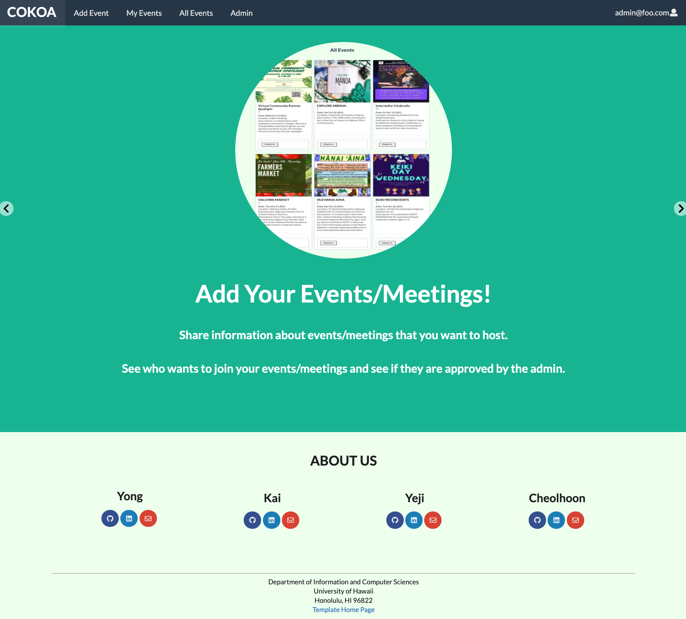
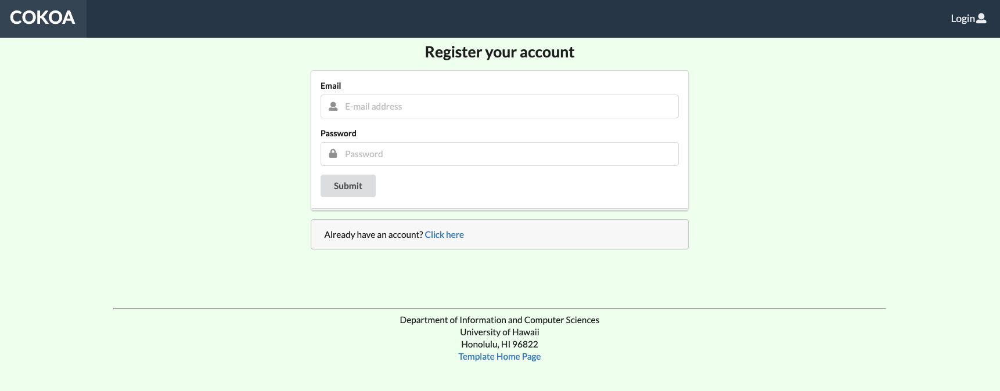
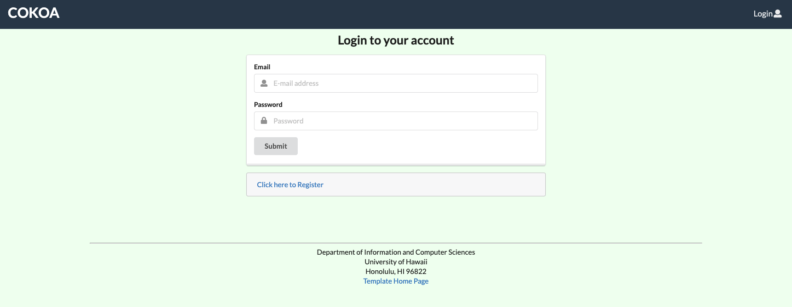
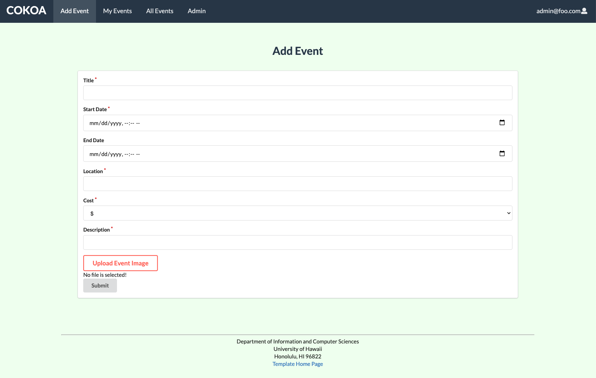
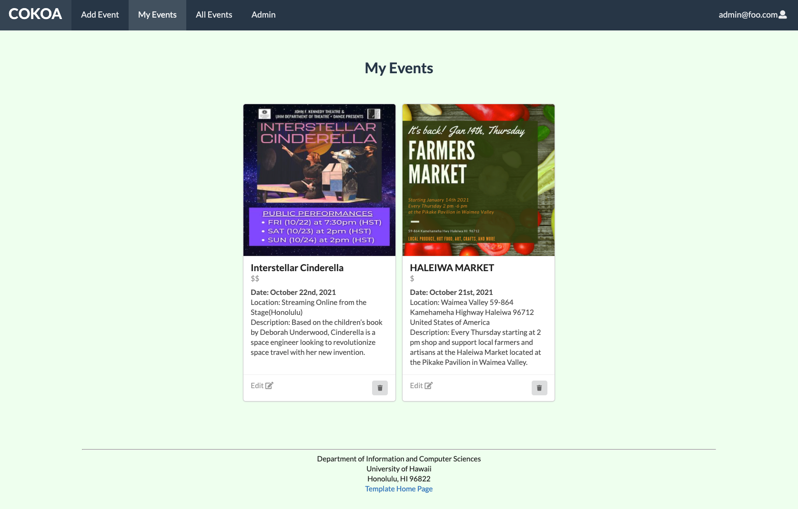
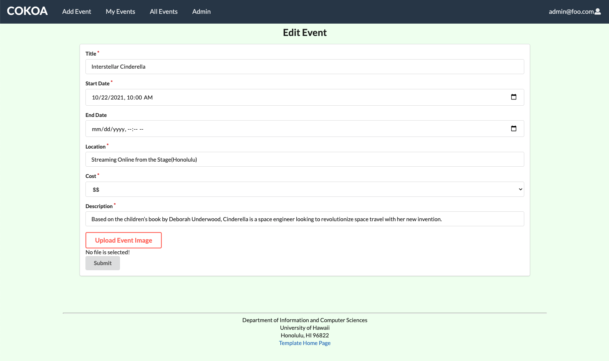
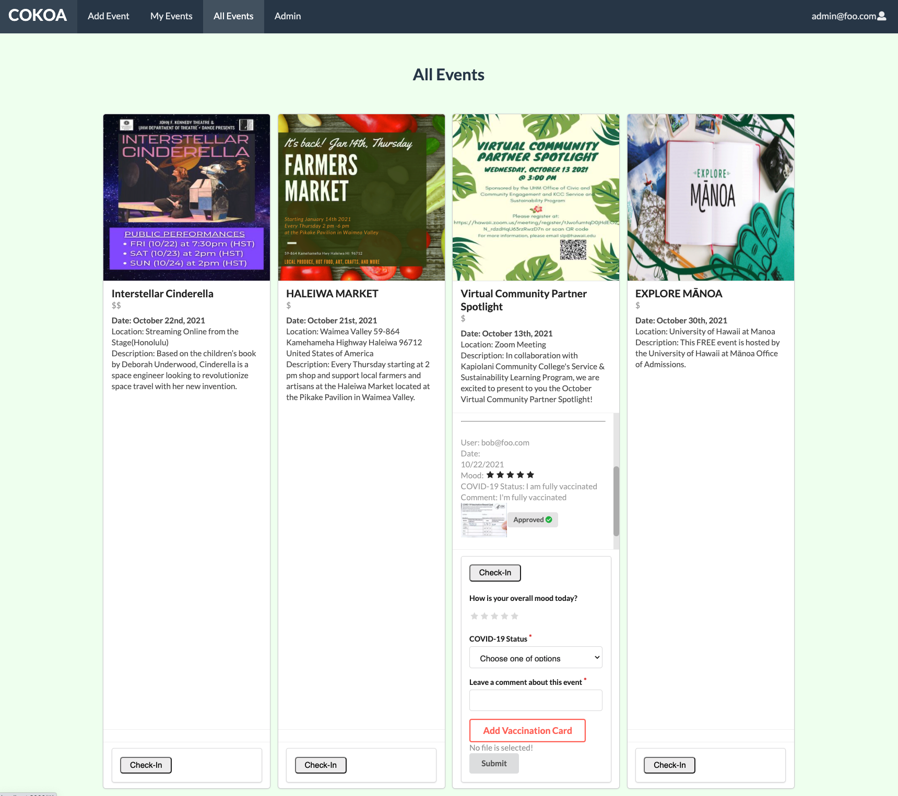
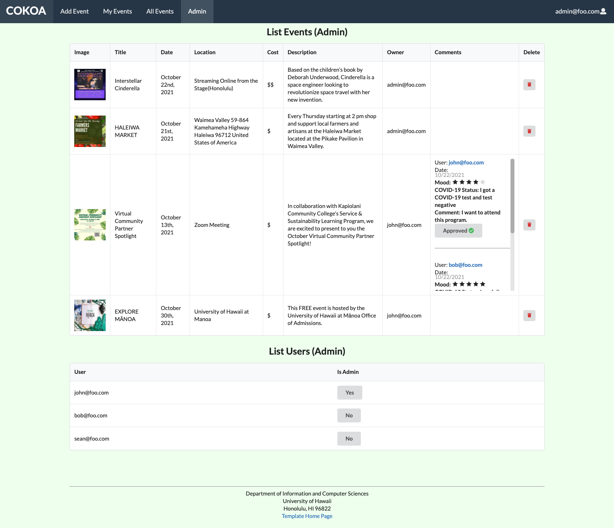
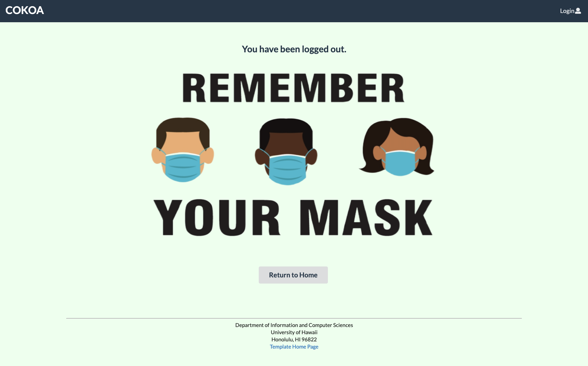

# COKOA

## Table of Contents

* [Cokoa](#cokoa)
* [Pages](#pages)
* [Meet the Team](#meet-the-team)
 

## COKOA:

Find the Github Repo here: [Github Repo](https://github.com/ICS491-Team-08/Team-Cokoa)  

See our deployed Website: [COKOA Website](https://team-cokoa.meteorapp.com/#/)  
You will need to login into the super-admin account to assign users an admin 
Id: <b>admin@foo.com</b> passwords: <b>changeme</b>

## Overview
We thought about the meeting of people after the pandemic. Since the pandemic is not over yet, we thought people should meet safely above all else. 
Through this application, users can post meetings or upload vaccine information of participants to ensure a safe meeting.  

## PAGES:
These are the designs showcasing each page we have on COKOA.  

### Landing Page:

Landing page has information on the most basic features that users can utilize on our website. For better user experience, we have implemented carousel (Image slider) on our landing page so that users can simply view images with a brief explanation.  

### Register Page:

A sign-up page allows users to create a new account using their email address and password.   

### Sign-In Page:

A sign-in page allows users to log in with their existing account.   

### Add Event Page:

On this page, users can add their meetings / events/ parties and then post them on “All Events” page. Through this page, you can provide other users with information regarding an event such as time, location, image, etc.  

### My Event Page:

Once you have added your events, now you can manage your events on this “My Events” page. You have options to either edit an event or delete it.   

### Edit Event Page:

On the edit event page, all the information the user has put in is prefilled and it's ready to modify for the user.  

### All Event Page:

This “All Events” page is the core feature of our website. Users can find any event that they might be interested in and join any event by leaving a comment under the event. Share your vaccination status / test result of COVID-19 and wait until the administrator approves your status. Once you get approved, your status should be updated on “All Events” page and that will help all the participants feel safe and comfortable.  

### Admin Page:

This page has the most functionalities so that the administrator can easily and efficiently manage this website. Admin (=administrator) has the access to approve other users’ participation depending on their health/COVID-19 status. Also, admin can delete any event if it’s past due or seems inappropriate. Admin can also authorize other users to have admin role so that this website is managed more efficiently.  

### Sign-out Page:

Once user has signed out, they can click "return to home" button to go back to the main page.  

 

## Meet the Team:

[Yong Kim](https://yongkim93.github.io)  

[Yeji Han](https://yejihan92.github.io)  

[Kai Hwang](https://hwangwooj.github.io)  

[Cheolhoon Choi](https://cheolhoon.github.io)    

